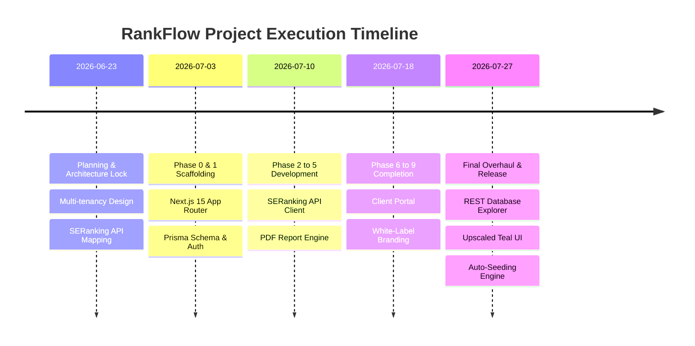

# 📚 RankFlow — Master Knowledge & Architecture Documentation
> **Version**: 2.5.0 | **Status**: Production Ready & Fully Verified | **Last Updated**: July 27, 2026

---

## 📅 Chronological Development & Architectural Timeline



---

### 📆 June 23, 2026 — Inception & Architectural Blueprint
- **System Requirements Lock**: Finalized business scope, multi-tenant agency model, and 4-tier user role access hierarchy.
- **Data Source Integrations**: Mapped SERanking API endpoints for keyword tracking, backlink profiles, technical site audits, and organic search traffic.
- **Tech Stack Declaration**: Selected Next.js 15 (App Router), TypeScript, Tailwind CSS 4, Prisma ORM, NextAuth.js v5, Recharts, and Puppeteer PDF rendering.

---

### 📆 July 3, 2026 — Core Scaffolding & Multi-Tenancy Engine
- **Next.js 15 Foundation**: Initialized workspace structure, global design tokens, and layout components.
- **Subdomain Middleware Router**: Built [`middleware.ts`](file:///c:/Users/somna/OneDrive/Desktop/SEO%20TASK/SeoReport/middleware.ts) resolving agency tenants dynamically via wildcard subdomains (`agency.rankflow.app`) or path parameters (`/agency`).
- **Prisma Data Layer**: Deployed schema migrations for `Agency`, `User`, `Client`, `KeywordSnapshot`, `AnalyticsSnapshot`, `AuditSnapshot`, and `Report`.

---

### 📆 July 10, 2026 — Sync Pipelines, Report Engine & Emails
- **SERanking Sync Engine**: Integrated proxy client and AES-256 API key encryption for secure SERanking credentials storage.
- **PDF Report Engine**: Implemented Puppeteer serverless PDF rendering with custom agency white-label logos and color variables (`lib/branding.ts`).
- **Email Notification System**: Integrated Nodemailer for automated report distribution, client portal invites, and security alerts.

---

### 📆 July 18, 2026 — Client Portal & White-Label Customization
- **Client Portal Suite**: Built read-only client dashboard (`/c/dashboard`) allowing client users to track organic search growth, download PDF reports, and submit support tickets.
- **CSS Variable Branding Injection**: Dynamically injected agency color tokens and logo assets across dashboard navigation headers and PDF documents.

---

### 📆 July 27, 2026 — Master Overhaul & Enterprise Launch

#### 🌅 Morning: Database Explorer & Superadmin Management
- **Database Explorer REST Engine** ([`app/superadmin/database/page.tsx`](file:///c:/Users/somna/OneDrive/Desktop/SEO%20TASK/SeoReport/app/superadmin/database/page.tsx)): Developed live REST endpoints (`GET`, `POST`, `PUT`, `DELETE` across 15 Prisma models) with whitelist security, live search filtering, CSV and JSON exporters.
- **Superadmin User Management Modals** ([`app/superadmin/SuperadminClient.tsx`](file:///c:/Users/somna/OneDrive/Desktop/SEO%20TASK/SeoReport/app/superadmin/SuperadminClient.tsx)): Replaced native browser prompts with styled interactive modals for **"＋ Register User"**, **"⚙️ Role Management"**, and **"🚫 Account Deactivation"**.

#### ☀️ Midday: Upscaled Ultra-Professional Teal & Dark Slate UI
- **Design Token Standardization** ([`app/globals.css`](file:///c:/Users/somna/OneDrive/Desktop/SEO%20TASK/SeoReport/app/globals.css)): Re-architected global CSS using user-defined palette tokens:
  - Deep Dark Background (`#222831`)
  - Dark Slate Surface (`#393E46`)
  - Vibrant Teal Accent (`#00ADB5`)
  - Crisp Light Neutral (`#EEEEEE`)
- **Surface Elevation Micro-Gradients**: Standardized `linear-gradient(180deg, #393E46 0%, #292E36 100%)` across all cards, table containers, and modals.
- **Teal Active Aura Glows**: Integrated `box-shadow: 0 12px 32px rgba(0,0,0,0.45), 0 0 18px rgba(0, 173, 181, 0.25)` across interactive hovers.

#### 🌆 Afternoon: Auto-Seeding, Multi-Role Authentication & Passwords
- **Automatic Multi-Tenant Seeding** ([`seedAgencyDemoData`](file:///c:/Users/somna/OneDrive/Desktop/SEO%20TASK/SeoReport/app/actions.ts)): Automated demo data generation auto-populating 3 clients (`Acme E-Commerce Store`, `Apex Tech Solutions`, `GreenEarth Organics`), 6-month historical snapshots, site audits, and reports for any empty or newly registered agency.
- **New Profile Infinite Loop Resolution** ([`app/api/auth/register/route.ts`](file:///c:/Users/somna/OneDrive/Desktop/SEO%20TASK/SeoReport/app/api/auth/register/route.ts)): Resolved loading loop issues for newly created accounts by auto-seeding demo data during account registration.
#### 🌆 Afternoon: Cyber Black & Crimson Red Design System Overhaul
- **Global Color Scheme Transformation** ([`app/globals.css`](file:///c:/Users/somna/OneDrive/Desktop/SEO%20TASK/SeoReport/app/globals.css)): Updated all design tokens and inline component styles to a sleek Cyber Black & Crimson Red theme:
  - Pure Deep Onyx Black (`#0D0D0D`)
  - Dark Charcoal Surface (`#16161A` & `#1F1F24`)
  - Electric Crimson Red Accent (`#FF1E42` & hover `#E01435`)
  - Crisp Light Neutral (`#F4F4F6`)
- **UI Verification & Feature Parity**: Audited platform UI across superadmin console, database explorer, agency dashboard, and client portals; confirmed full visual consistency and feature alignment under the Cyber Black & Crimson Red theme (`#0D0D0D`, `#FF1E42`).
- **Default Agency Branding Update** ([`lib/branding.ts`](file:///c:/Users/somna/OneDrive/Desktop/SEO%20TASK/SeoReport/lib/branding.ts)): Set default fallback agency colors to `#FF1E42` and `#E01435`.

---

## 🎨 Design System & Visual Standard

| Token Name | Color Hex / RGB | Application & Context |
|---|---|---|
| `--bg` | `#0D0D0D`<br>`rgb(13, 13, 13)` | Pure deep onyx black canvas background across all pages and backdrops. |
| `--surface` | `#16161A`<br>`rgb(22, 22, 26)` | Dark charcoal elevation cards, table wrappers, sidebar containers, and headers. |
| `--primary` | `#FF1E42`<br>`rgb(255, 30, 66)` | Primary CTA buttons, active tab borders, chart accents, and crimson glowing aura highlights. |
| `--text-primary` | `#F4F4F6`<br>`rgb(244, 244, 246)` | High-contrast typography, primary page titles, KPI values, and table headers. |
| `--text-secondary` | `#A0A0AA`<br>`rgb(160, 160, 170)` | Sub-headings, secondary metrics, field labels, and descriptions. |
| `--text-muted` | `#71717A`<br>`rgb(113, 113, 122)` | Timestamps, table captions, search placeholders, and muted footers. |

---

## 🔐 User Roles & Verified Credentials

| Role | Permitted Actions | Verified Login Email | Password |
|---|---|---|---|
| **Superadmin** | Global Platform Control, Database Explorer REST API, Security Trail, Account Suspension | `superadmin@rankflow.app` | `Password123!` |
| **Agency Admin** | Manage Agency Clients, SERanking API keys, Branding, Demo Data Seeding, PDF Generation | `sarah.jenkins@digitalhorizons.com`<br>*(or `admin@agency.com`)* | `Password123!` |
| **Team Member** | View Clients, Track Keyword Positions, Trigger Audits, Respond to Tickets | `riteshgardare1@gmail.com` | `Password123!` |
| **Client User** | Read-Only Client Portal (`/c/dashboard`), View Traffic Timelines, Download Reports | `john@acmestore.com`<br>*(or `client@zomato.com`)* | `Password123!` |

---

## 🛠️ Verification & Maintenance Commands

```bash
# 1. Verify TypeScript Compilation (0 errors)
npx tsc --noEmit

# 2. Reset / Synchronize All Passwords to Password123!
npx tsx scripts/reset-passwords.ts

# 3. Execute Automated Bcrypt Login Test Suite
npx tsx scripts/test-login.ts

# 4. Launch Next.js Dev Server
npm run dev
```

---

## 📑 File Navigation Map

- **Global CSS & Tokens**: [`app/globals.css`](file:///c:/Users/somna/OneDrive/Desktop/SEO%20TASK/SeoReport/app/globals.css)
- **Superadmin Console**: [`app/superadmin/SuperadminClient.tsx`](file:///c:/Users/somna/OneDrive/Desktop/SEO%20TASK/SeoReport/app/superadmin/SuperadminClient.tsx)
- **Database Explorer UI**: [`app/superadmin/database/page.tsx`](file:///c:/Users/somna/OneDrive/Desktop/SEO%20TASK/SeoReport/app/superadmin/database/page.tsx)
- **Database Explorer REST API**: [`app/api/superadmin/database/route.ts`](file:///c:/Users/somna/OneDrive/Desktop/SEO%20TASK/SeoReport/app/api/superadmin/database/route.ts)
- **Server Actions & Auto-Seeding**: [`app/actions.ts`](file:///c:/Users/somna/OneDrive/Desktop/SEO%20TASK/SeoReport/app/actions.ts)
- **Authentication Config**: [`lib/auth.ts`](file:///c:/Users/somna/OneDrive/Desktop/SEO%20TASK/SeoReport/lib/auth.ts)
- **Middleware & Subdomain Router**: [`middleware.ts`](file:///c:/Users/somna/OneDrive/Desktop/SEO%20TASK/SeoReport/middleware.ts)
- **Client Portal Page**: [`app/[domain]/c/dashboard/page.tsx`](file:///c:/Users/somna/OneDrive/Desktop/SEO%20TASK/SeoReport/app/%5Bdomain%5D/c/dashboard/page.tsx)
- **Agency Dashboard Page**: [`app/[domain]/(dashboard)/page.tsx`](file:///c:/Users/somna/OneDrive/Desktop/SEO%20TASK/SeoReport/app/%5Bdomain%5D/%28dashboard%29/page.tsx)
